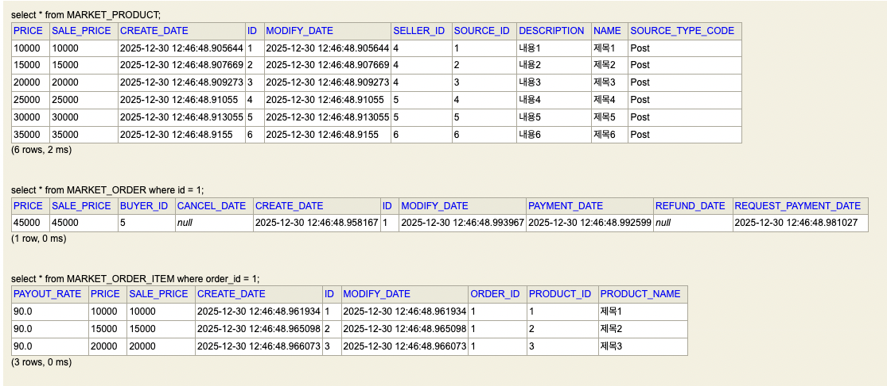
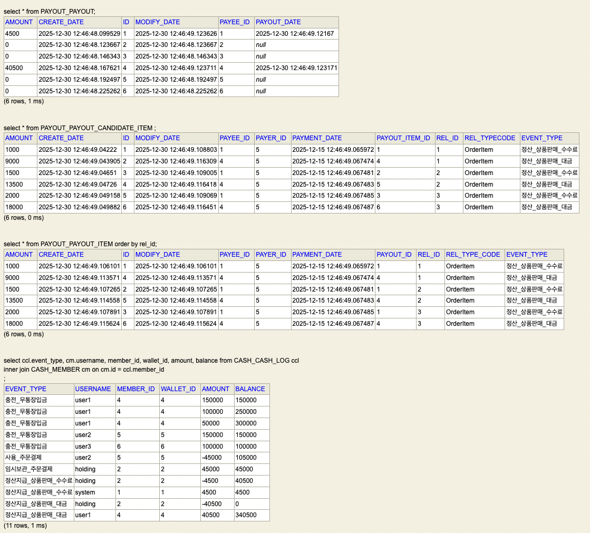

# 주문-결제-정산 시스템

## 📋 Process 개요

### 주문 결제 구조
- **Product**: 상품 정보
- **Cart & CartItem**: 장바구니 및 장바구니 아이템
- **Cash & Wallet**: 현금 및 지갑 (충전을 통한 결제)
- **Order & OrderItem**: 주문 및 주문 아이템 (금액 차감)

### 정산 로직

주문금액: 10,000원, 수수료: 10% → 판매자: 9,000원, 플랫폼 수수료: 1,000원

**정산 조건**: 결제일 기준 15일 이후 판매자 대금 정산  
**수수료 처리**: 서비스(플랫폼) 수수료 holding → system으로 이전

## 💡 정산 처리 방식

### 1️⃣ 실시간 연산 방식
- 수수료 비율
- 구매 정보  
- 정산 시 실시간 연산

### 2️⃣ 데이터 축적 후 배치 처리 방식 ⭐
- 수수료 비율
- 구매 정보
- 정산 기반 데이터 미리 생성

## 🔄 Payout 처리 Flow

결제 완료 → PayoutCandidateItem → 15일 대기 → PayoutItems → 정산 처리

### PayoutCandidateItem
- **목적**: 정산 데이터 후보 저장소
- **이유**: 결제일 도달 전 환불 등으로 정산 취소 가능성 존재
- **상태**: 대기 중인 정산 데이터

### PayoutItems
- **목적**: 실제 정산 처리 확정 데이터
- **조건**: 결제일 15일 경과 후
- **처리**: 정산 실행 데이터

---

## 📊 데이터베이스 구조

### Market 테이블

**주요 정보:**
- `market_product`: 상품의 `seller_id` 보유
- `MarketDataInit`: order_id = 1인 주문만 결제 요청 처리
- `order_item`: 각각 10,000원, 15,000원, 20,000원 주문 금액

### Payout 테이블

| 테이블 | 역할 | 설명 |
|--------|------|------|
| `payout_payout` | 정산 현황 | 회원별 정산 대상 금액 관리 |
| `payout_payout_candidate_item` | 정산 대기 | 결제 요청 시 즉시 생성, 14일 대기 상태 |
| `payout_payout_item` | 정산 확정 | 최종 승인 후 실제 정산 대상, BatchJob 처리 |
| `cash_cash_log` | 거래 로그 | 실제 자금 이동 내역 기록 |

## 💰 Cash Log 처리 과정

1. **결제 처리** 📤  
   주문번호 1 결제 → user2에서 45,000원 차감

2. **임시 보관** 🏦  
   정산 처리 전까지 holding에서 보유금 관리

3. **수수료 정산** 💼  
   holding에서 수수료 차감 → system에게 지급

4. **판매자 정산** 💸  
   잔여 금액 → seller(user1)에게 상품 판매대금 지급

 